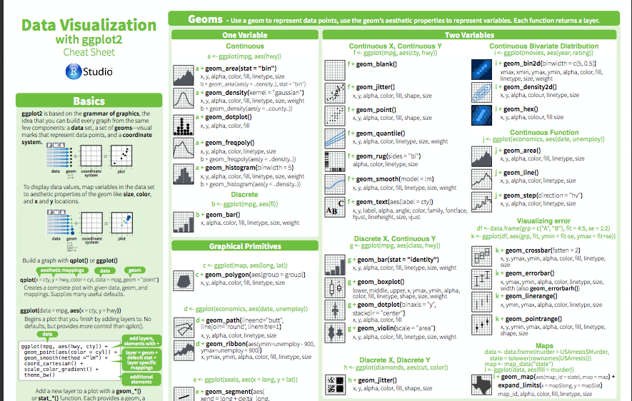
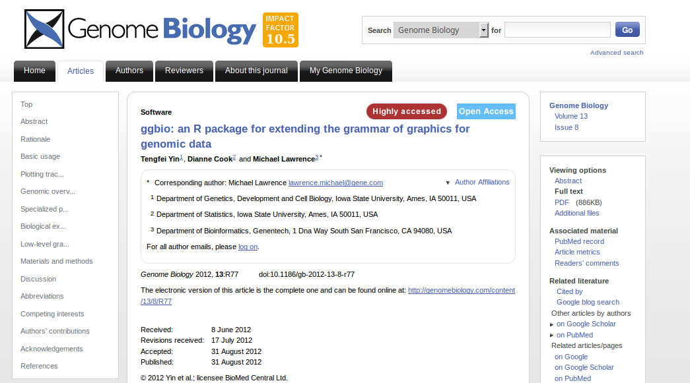
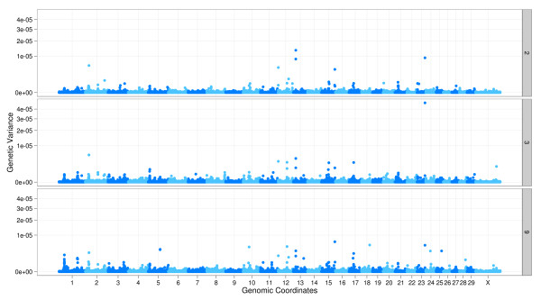
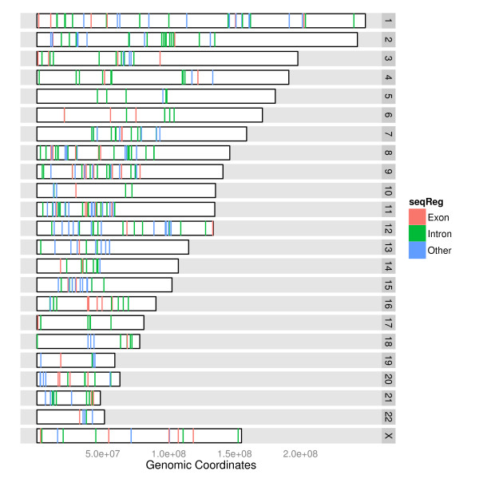
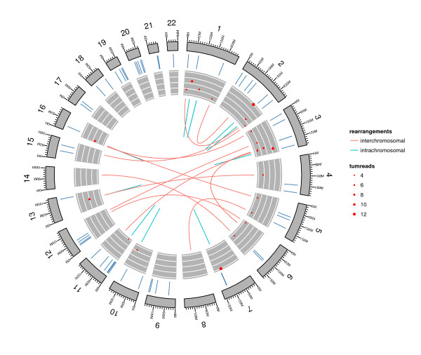

## Previously

- Introduced Bioconductor facilites for manipulating strings and ranges
- Executed workflow to find to identify genes and regions of interest in an RNA-seq experiment

## Aims for this session

- Obtaining annotation information from different sources
    + Biomart
    + Pre-built Bioconductor packages
    + Browser tracks
- Visualise
    + Aligned sequencing reads
    + Coverage
    + Gene models

    
# biomaRt
    
## biomaRt

- A wealth of annotation resources are available online through the [biomart](http://www.biomart.org) web software suite. 
- One-off queries are possible. But are they reproducible? What if you need to do further analysis on the results in R?
- Results generated using Bioconductor can be easily annotated against the vast wealth of online data available in biomart
- User does not need to construct complex SQL queries

## Connecting to biomaRt

```{r}
library(biomaRt)
head(listMarts(), 5)    
ensembl <- useMart("ensembl")
```

## Connecting to biomaRt

```{r}
ensembl <- useMart("ensembl", 
                   dataset = "hsapiens_gene_ensembl")
head(listDatasets(ensembl),10)
```

## An example query

Say we want to find out more information about a given ***Entrez***
gene(s). 

- Essentially we want to subset the database according to a particular *filter*.
- Available filters can be listed.

```{r}
head(listFilters(ensembl), 5)     
```

```{r}
flt <- listFilters(ensembl)
flt[grep("entrez", flt[,1]),]
```

## Attributes

- *Attributes* are the information that can be retreived 
```{r}
head(listAttributes(ensembl), 25)
```

## Forming the query
- We are going to use `entrezgene`
- First specify the filter type, and values
    + these must be valid identifiers for the filter type
    + in our case, valid Entrez IDs
```{r}
entrez <- c("673", "837")
myfilter <- "entrezgene"
```
- Specify the attributes you want to retrieve
    + this must be in the first column of the output of `listAttributes`

```{r}
attr = c("entrezgene", "hgnc_symbol", "ensembl_gene_id","description")
allAttr <- listAttributes(ensembl)
attr %in% allAttr[,1]
```
- Plug all the values into the `getBM` function
```{r}
myInfo <- getBM(filters="entrezgene",
    values=entrez,
    attributes=attr,
    mart=ensembl)
```

## View the results

```{r}
myInfo
```

- Note that we don't necesarily get a data frame with one row per ID we specified
    + in this case, one gene had more than one ensembl ID
    + technically, we would say the mapping is *one-to-many*

## Using multiple filters

- A common query is to list genes within a certain genomic interval
    + e.g. regions of interest from a CHiP-seq analysis
- This time, our filters would be chromosome name, start and end
    + we can specify these in a vector
    + check the correct names by looking at the output of `listFilters`
```{r}
myfilters <- c("chromosome_name", "start", "end")
```
- The values need to be specified in a list
```{r}
myvalues <- list(16, 1100000, 1250000)
```
- Define attributes as before
    + be careful that `start` and `end` are not valid *attribute* names 
```{r}
head(allAttr[grep("start", allAttr[,1]),])

attr <- c("ensembl_gene_id", "hgnc_symbol","entrezgene","chromosome_name", "start_position", "end_position")
```

## Make the query

```{r}
myInfo <- getBM(attributes = attr,
  filters = myfilters,
  values=myvalues,mart=ensembl)
myInfo
```

## Reversing the query

- i.e supply gene names and get their positions

```{r}
myfilters <- "ensembl_gene_id"
values = c("ENSG00000261713","ENSG00000261720","ENSG00000181791")
attr <- c("ensembl_gene_id","chromosome_name","start_position", "end_position","entrezgene")
getBM(attributes = attr, filters = myfilters, values = values,
ensembl
)
```


# Bioconductor Annotation Resources

## Organism-level Packages

- Bioconductor maintain a number of organism-level packages which
are re-built every 6 months. A central identifier (Entrez gene id) is used.
- These are listed on the annotation section of Bioconductor
    + [here](http://bioconductor.org/packages/release/BiocViews.html#___AnnotationData)
    + named *org.X.ID.db*
    + where X is a two-letter organism acronym; i.e. Hs for human
    + ID represents which identifier scheme is used i.e. eg for Entrez 
- Installed in the same way as regular Bioconductor packages
    + `source("http://www.bioconductor.org/biocLite.R")`
    + `biocLite(.....)`

```{r message=FALSE} 
library(org.Hs.eg.db)
```
- Larger download size, but you only need to download once per-Bioconductor release
- Enable *offline* queries

## Filtering an organism package

- `keytypes` are the names of the filters we can use

```{r}
keytypes(org.Hs.eg.db)
```
- We can see the names of valid keys
```{r}
length(keys(org.Hs.eg.db,keytype="ENTREZID"))
head(keys(org.Hs.eg.db,keytype="ENTREZID"))
```

## Selecting attributes

- the attributes are `columns`
    + think the columns of a table that we want to look up
```{r}
columns(org.Hs.eg.db)
```

## Example query

```{r}
entrez <- c("673", "837")
select(org.Hs.eg.db, keys=entrez,
  keytype="ENTREZID",
  columns=c("SYMBOL","CHRLOC","CHRLOCEND"))
```

## Another query
> Give me the *Symbols* of every gene with *GO* ontology *GO:0003674*
```{r}
head(select(org.Hs.eg.db, keys = "GO:0003674",
keytype = "GO", columns = "SYMBOL"))
```

## Managing gene models: GenomicFeatures

- The GenomicFeatures package retrieves and manages transcript-related features from the UCSC Genome browser and BioMart data resources
- Transcript metadata is stored in an *TranscriptDb* object
- The object maps 5' and 3' UTRs, protein coding sequences (CDS) and exons for a set of mRNA transcripts to their associated genome
- *SQLite* database used to manage relationships between transcripts, exons, CDS and gene identifiers
- Again, *offline* queries can be made

## Pre-built packages

- Again a full list of packages is available on the BioC website
    + [here](http://bioconductor.org/packages/release/BiocViews.html#___AnnotationData)
- For humans, latest version is `TxDb.Hsapiens.UCSC.hg19.knownGene`
    + a convention is to assign the object to a shorter name to save some typing
```{r}
library(TxDb.Hsapiens.UCSC.hg19.knownGene)
txdb <- TxDb.Hsapiens.UCSC.hg19.knownGene
```

## The transcriptDB object

```{r}
txdb
```

## keys for the object

- As for the organism packages, we can see what keys are available

```{r}
keytypes(txdb)
columns(txdb)
```

## Making a query

```{r}
select(txdb, keys=entrez,
keytype="GENEID",
columns=c("TXID",
"TXCHROM", "TXSTART",
"TXEND"))
```

## Querying the exons

```{r}
mygene <- select(txdb, keys = "673", keytype = "GENEID",
columns = c("EXONID", "EXONCHROM", "EXONSTART","EXONEND","EXONSTRAND"))
mygene
```

## Exon Structure

- We could of course create a `GRanges` object from this

```{r}
GRanges(mygene$EXONCHROM, IRanges(mygene$EXONSTART,
mygene$EXONEND),strand=mygene$EXONSTRAND,exon_id=mygene$EXONID)
```

## Convenience Functions

```{r}
trs <- transcripts(txdb)
trs

```

## Retrieve all exons at once

```{r}
exs <- exons(txdb)
exs
```

## Group by genes

```{r}
exons <- exonsBy(txdb, "gene")
is(exons)
length(exons)
```

see also `transcriptsBy`, `intronsByTranscript`, `fiveUTRsByTranscript`, `threeUTRsByTranscript`

## How to subset this object

```{r}
exons[["673"]]
```

## Implications

- We now have a way of retrieving transcript and exon locations as `GRanges`.
- Any function that uses a `GRanges` object can easily interact with gene locations
    + Reading subset of a bam file
    + Counting overlaps
    + Retrieving genome sequence
    
## Examples

Retrieve the subset of reads that overlap a particular gene. 

- First, return the positional information about the gene as a `GRanges` object
```{r}
gr <- exons[["49"]]
```
- Then, pass the `GRanges` object into the `readGAlignments` function
    + here, the `system.time` function is used to report how long the function takes
 
```{r, echo=FALSE} 
mybam <-"exampleData/NA19914.chr22.bam"
gr <- renameSeqlevels(gr, c("chr22"= "22"))
 
``` 
 
 
```{r}
library(GenomicAlignments)
system.time(bam.sub <- readGAlignments(file = mybam,
    use.names = TRUE, param = ScanBamParam(which = gr)))
```

## Examine the output

```{r}
bam.sub
```


## Retrieving gene sequences

```{r message=FALSE}
library(BSgenome.Hsapiens.UCSC.hg19)
hg19 <- BSgenome.Hsapiens.UCSC.hg19
```


```{r}
system.time(seqs <- getSeq(hg19, exons[["49"]]))
seqs
width(exons[["49"]])
```

## Alternative counting 

```{r}
bam <- readGAlignments(file = mybam)
countOverlaps(gr, bam)
```

## Other sources of annotation

- The `rtracklayer` package allows a number of standard genome *tracks* to be imported
    + *bed*
    + *gff*
    + *wig*
- The result is a `GRanges` object - of course!


```{r eval=FALSE}
library(rtracklayer)
download.file("http://www.nimblegen.com/downloads/annotation/ez_exome_v3/SeqCapEZ_Exome_v3.0_Design_Annotation_files.zip",destfile="Nimblgen-regions.zip")
unzip("Nimblgen-regions.zip")
nimb <- import("SeqCap_EZ_Exome_v3_primary.bed")
nimb
```

```{r echo=FALSE}
library(rtracklayer)
if(!file.exists("SeqCap_EZ_Exome_v3_primary.bed")){ 
  download.file("http://www.nimblegen.com/downloads/annotation/ez_exome_v3/SeqCapEZ_Exome_v3.0_Design_Annotation_files.zip",destfile="Nimblgen-regions.zip")
  unzip("Nimblgen-regions.zip")
}
nimb <- import("SeqCap_EZ_Exome_v3_primary.bed")
nimb
```

## Practical time
Exploring RNA-seq results

- Using biomaRt
- organism packages
- transcript databases


# Visualisation

## More-advanced graphics in R

- Base graphics in R use a canvas model
    + series of instructions that sequentially fill the plotting canvas
    
- ggplot2 employs a `grammar of graphics approach`
- The components are
    + a datset
    + geometric object that is visual representation of the data
        + e.g. points, lines, etc
    + mapping of variables to visual properties of plot
        + ***aesthetics***
    + (statistical summarisation rule)
    + (coordinate system)
    + (facet specification)

## ggplot2 overview
ggplot2 [cheat-sheet](https://www.rstudio.com/wp-content/uploads/2015/03/ggplot2-cheatsheet.pdf)



## Plot Comparison

```{r fig.height=3}
x <- 1:10
y <- 2*x
plot(x,y)
```

```{r fig.height=3}
library(ggplot2)
df <-data.frame(x,y)
ggplot(df, aes(x=x,y=y)) + geom_point()

```

## Plot construction
- ggplot2 needs data as a data frame
- It needs to be ***long*** format

```{r}
library(reshape2)
df <- data.frame(A = rnorm(5,3), B=rnorm(5,1))
df[1:3,]
df2 <- melt(df)
df2
```

## Plot construction

```{r}
ggplot(df2, aes(x = variable,y=value)) + geom_boxplot()
```


## Plot construction

```{r fig.height=3}
ggplot(df2, aes(x = variable,y=value,fill=variable)) + geom_boxplot()
```

## Updating a plot

- ggplot2 will easily re-drawn a plot as new variables are added
    + a real advantage!
```{r fig.height=3}
df <- data.frame(A = rnorm(5,3), B=rnorm(5,1),C=rnorm(5,2))
df2 <- melt(df)
ggplot(df2, aes(x = variable,y=value,fill=variable)) + geom_boxplot()
```

    
## Introducing ggbio

- A consistent representation of ranges and genomic data helps with visualisation
- The `ggbio` package is a toolkit for producing publication-quality images from genomic data
- It extends the ***Grammar of Graphics*** approach taken by `ggplot2`
- It knows about the standard Bioconductor classes we have already introduced
- Published in [Genome Biology](http://www.genomebiology.com/2012/13/8/R77)


## The autoplot function

- Guesses what type of plot you want from the data
- Figures out the x and y coordinates
```{r message=FALSE}
library(ggbio)
autoplot(bam.sub)
```

## Can choose a summary statistic

```{r message=FALSE}
autoplot(bam.sub,stat="coverage")
```

## Plotting gene structure

```{r message=FALSE}
autoplot(txdb,which=exons[["49"]])
```

## Combining plots

- plots made by `ggplot2` cannot be customised in the usual way with `par`
    + e.g. `par(mfrow=c(1,2))`
- the `tracks` function in `ggbio` can do this job    
- x-axis structure is consistent between plots

```{r message=FALSE}
tracks(autoplot(txdb,which=exons[["49"]]),
autoplot(bam.sub,stat="coverage"))
```

## Different layouts available

- Can easily switch between different plot layouts
    + geoms in ggplot2 terms
- Also set aesthetics from properties in the data
    + using `aes`; like in `ggplot2`
- e.g. Manhattan plot



## Karyogram

Karyogram



## Circular



## Practical time

- Use `ggplot2` and `ggbio` to explore the RNA-seq results
- Feel free to experiment
- Or check-out the vignettes for either package